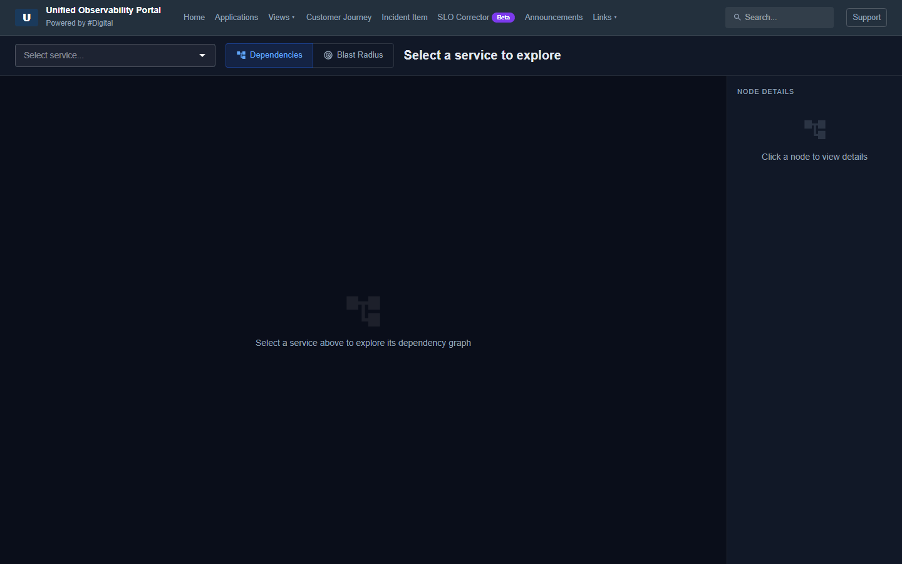
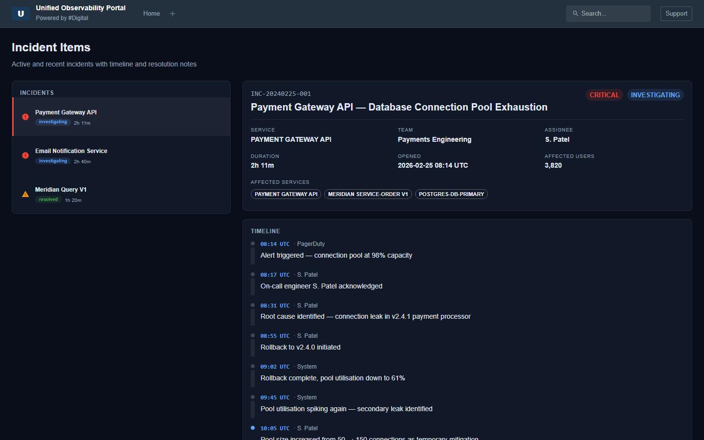
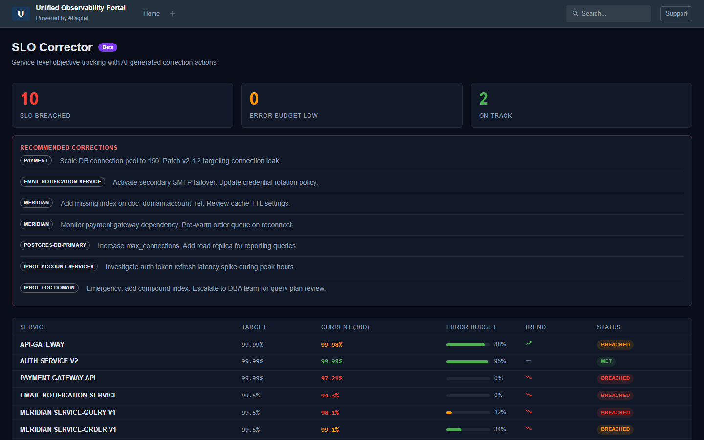
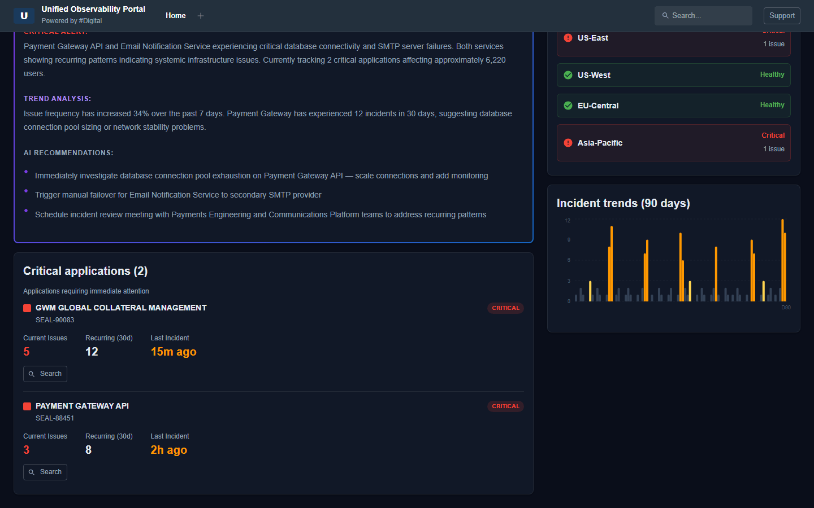

# Unified Observability Portal

A real-time observability dashboard for monitoring application health, service dependencies, incidents, and regional status across infrastructure.

---

## Demo

### Dashboard Overview
> Summary cards, AI health analysis, critical apps, regional status, and incident trends


---

### Applications
> Full application registry with status filtering, SEAL number search, and incident counts


---

### Knowledge Graph — Dependency View
> Click any service node to explore its downstream dependencies



---

### Knowledge Graph — Blast Radius View
> Switch to blast radius mode to see which services are impacted if a node fails


---

### Customer Journey
> End-to-end path health for Trade Execution, Client Login, and Document Delivery workflows


---

### Incident Item
> Incident list with full timeline, affected services, and resolution notes



---

### SLO Corrector *(Beta)*
> Service-level objective tracking with error budget bars and AI-generated correction actions



---

### Announcements
> Platform updates, scheduled maintenance, and incident communications with type filtering


---

### Incident Trends Chart
> 90-day bar chart with spike highlighting and interactive tooltips



---

### Links
> Quick-access grid for monitoring, CI/CD, security, documentation, and team tools


---

## Architecture

| Layer    | Stack                        | Port  |
|----------|------------------------------|-------|
| Frontend | React + Vite + MUI           | 5174  |
| Backend  | Python FastAPI + Uvicorn     | 8080  |

The frontend proxies all `/api/*` requests to the backend via Vite's dev server proxy.

---

## Major Features

- **Dashboard** — Summary cards for critical issues, warnings, recurring incidents, and today's incident count
- **AI Health Panel** — AI-generated critical alert, trend analysis, and actionable recommendations
- **Applications** — Full application registry with status filter, SEAL search, and incident history
- **Knowledge Graph** — Interactive service dependency map with blast-radius and dependency traversal
- **Customer Journey** — Step-by-step health for key user workflows (Trade, Login, Doc Delivery)
- **Incident Item** — Incident detail view with timeline, affected services, and resolution notes
- **SLO Corrector** *(Beta)* — SLO tracking with error budget bars and AI correction recommendations
- **Announcements** — Platform updates, maintenance windows, and incident communications
- **Incident Trends** — 90-day bar chart with spike detection and tooltip interaction
- **Links** — Quick-access grid for platform tools across 8 categories

---

## Navigation

The top nav starts with only the **Home** tab visible. Click the **+** button to add any tab. Each added tab has an **×** to close it. Choices persist across browser sessions via localStorage.

---

## Start

Open two terminals from the project root.

**Backend**
```bash
cd backend
python -m uvicorn main:app --reload --port 8080
```

**Frontend**
```bash
cd frontend
npm run dev
```

Open: http://localhost:5174

---

## Stop

**Kill all (recommended)**
```bash
taskkill //F //IM python.exe
taskkill //F //IM node.exe
```

**Kill by specific port**
```bash
# Find PIDs
netstat -ano | grep -E "8080|5174"

# Kill specific PID
taskkill //F //PID <pid>
```

**Check what's running**
```bash
netstat -ano | grep "LISTENING" | grep -E "8080|5174"
tasklist | grep -E "node|python"
```

---

## Project Structure

```
obs-dashboard/
├── backend/
│   ├── main.py          # FastAPI app — all endpoints and mock data
│   └── requirements.txt
├── frontend/
│   ├── src/
│   │   ├── components/  # TopNav, AIHealthPanel, CriticalApps, RegionalStatus, etc.
│   │   ├── pages/       # Dashboard, GraphExplorer, Applications, CustomerJourney,
│   │   │                #   IncidentItem, SloCorrector, Announcements, Links, Views
│   │   └── App.jsx      # Router and nav
│   └── vite.config.js   # Dev server — proxy points to :8080
└── docs/
    ├── make_gifs.py     # Playwright script to regenerate all GIFs
    └── gifs/            # Demo GIFs
```

---

## API Endpoints

| Method | Path                               | Description                          |
|--------|------------------------------------|--------------------------------------|
| GET    | `/api/health-summary`              | Critical/warning/incident counts     |
| GET    | `/api/ai-analysis`                 | AI-generated health analysis         |
| GET    | `/api/regional-status`             | Per-region health status             |
| GET    | `/api/critical-apps`               | Apps in critical/warning state       |
| GET    | `/api/incident-trends`             | 90-day incident trend data           |
| GET    | `/api/graph/nodes`                 | All service nodes                    |
| GET    | `/api/graph/dependencies/{id}`     | Downstream dependencies for service  |
| GET    | `/api/graph/blast-radius/{id}`     | Upstream impact for service          |

Interactive API docs: http://localhost:8080/docs
