# Unified Observability Portal

A real-time observability platform purpose-built for AWM engineering — combining AI-powered incident detection, service dependency mapping, SLO management, proactive health monitoring, and product-centric views across the entire platform ecosystem.

> **Powered by AWM Site Reliability Engineering (SRE)**

---

## Demo

### Home Dashboard
> Single pane of glass — critical apps with recent issues, AI health analysis, regional status, P1/P2 incident donuts, 90-day trend line chart, frequent incidents, and live activity feed.

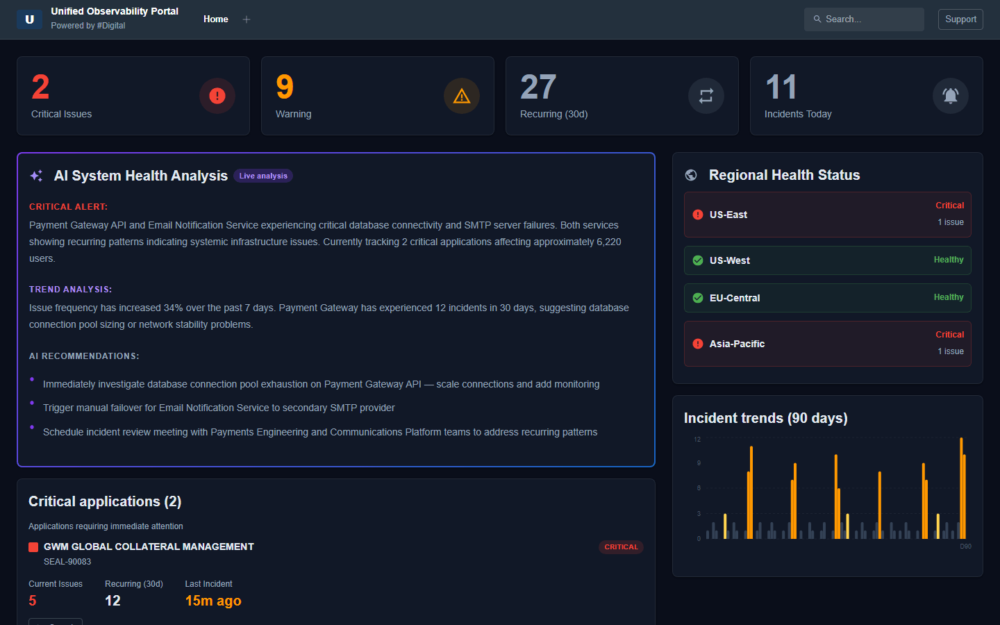

---

### Favorites
> Pin your most-used observability views for instant access. Star any view from View Central and see them all in one place.

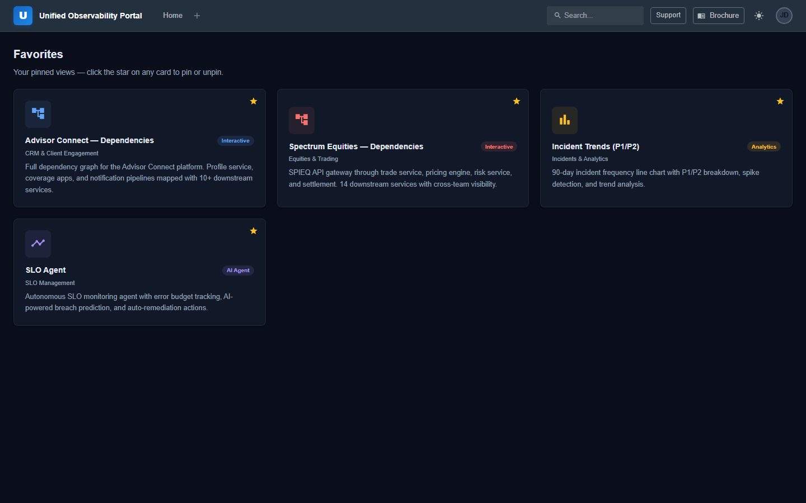

---

### View Central
> 12 observability views across dependency graphs, analytics dashboards, AI-powered tools, and live monitoring — searchable and organized by domain.

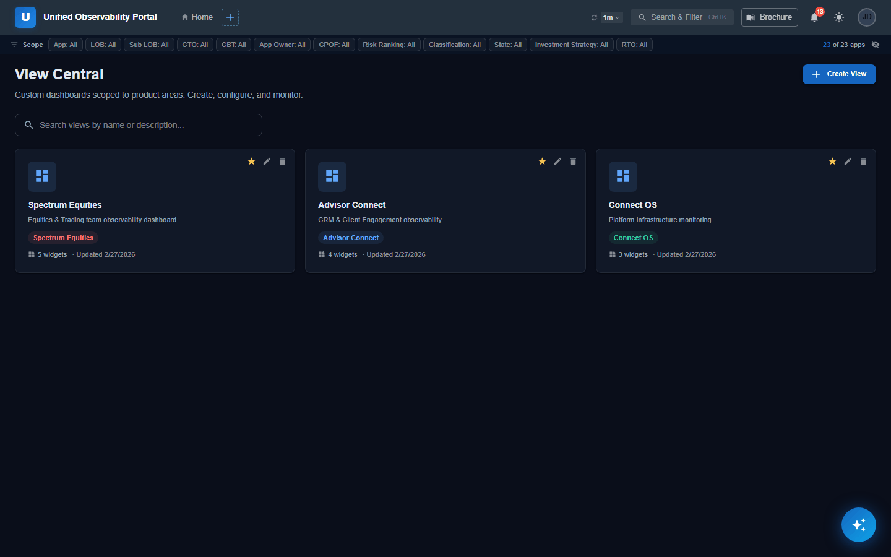

---

### Product Catalog
> 6 business products with per-product health status, service counts, and linked observability views.

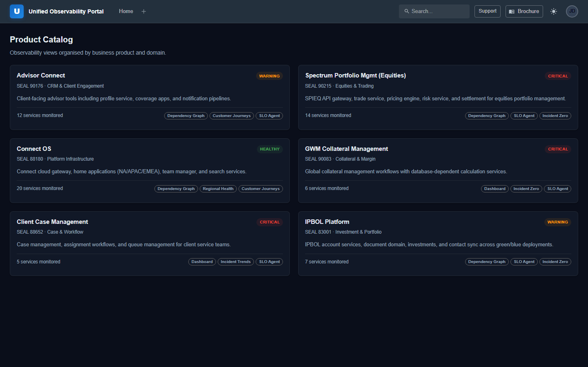

---

### Applications Registry
> 20+ registered applications with status, SLA targets, team ownership, and 30-day incident history — filterable by health status with full search.

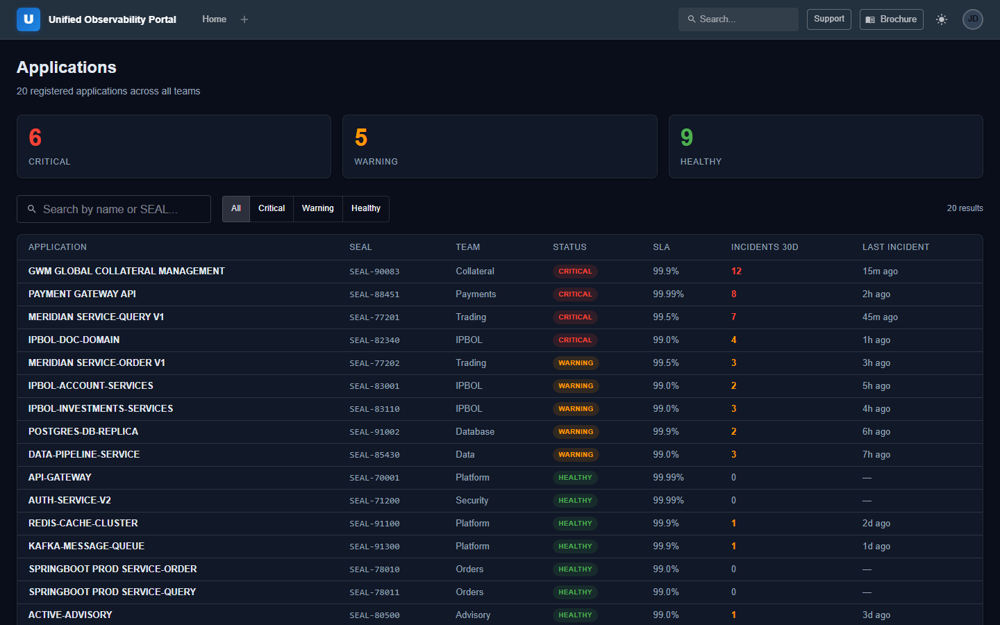

---

### Blast Radius — Dependency Graphs
> Interactive service dependency maps for Advisor Connect, Spectrum Equities, and Connect OS with executive summary, root cause analysis, business processes, and dagre-powered layouts.

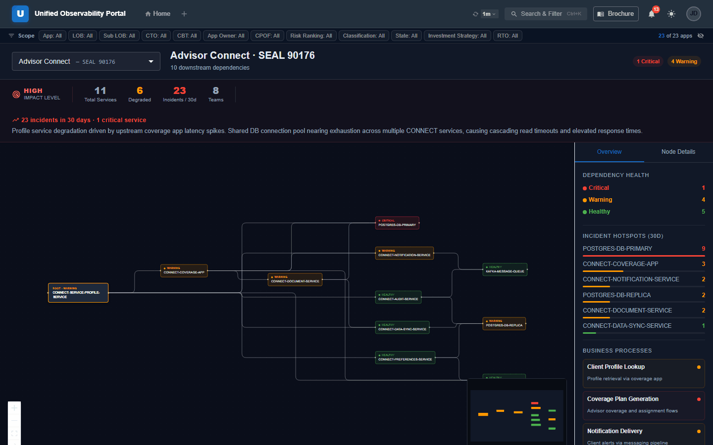

---

### Customer Journeys
> End-to-end path health for Trade Execution, Client Login, and Document Delivery — step-by-step latency and error rate visibility across every service hop.

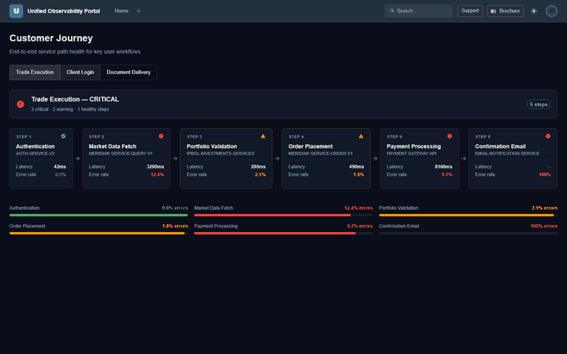

---

### SLO Agent
> Autonomous SLO monitoring agent that predicts breaches, proposes auto-remediation actions, and surfaces error budget burn rates before they cause incidents.

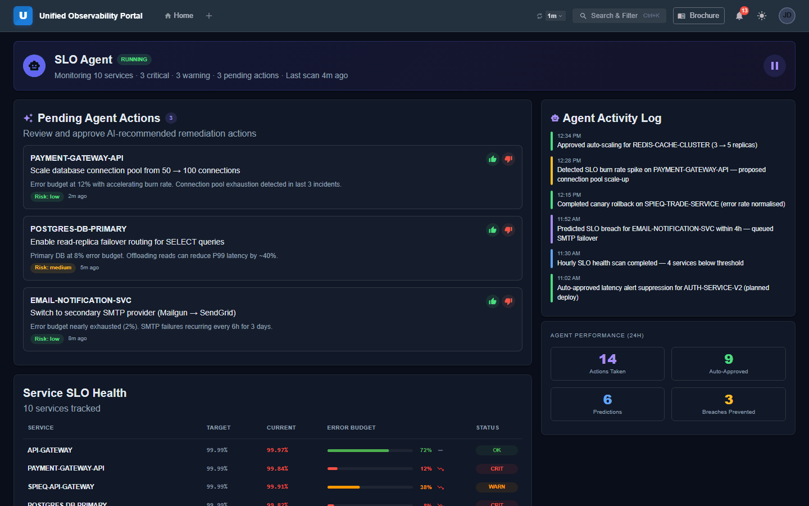

---

### Announcements
> Full CRUD announcement management — create, edit, close/reopen, delete, search, type filters, pinning, and auto-refresh every 30 seconds.

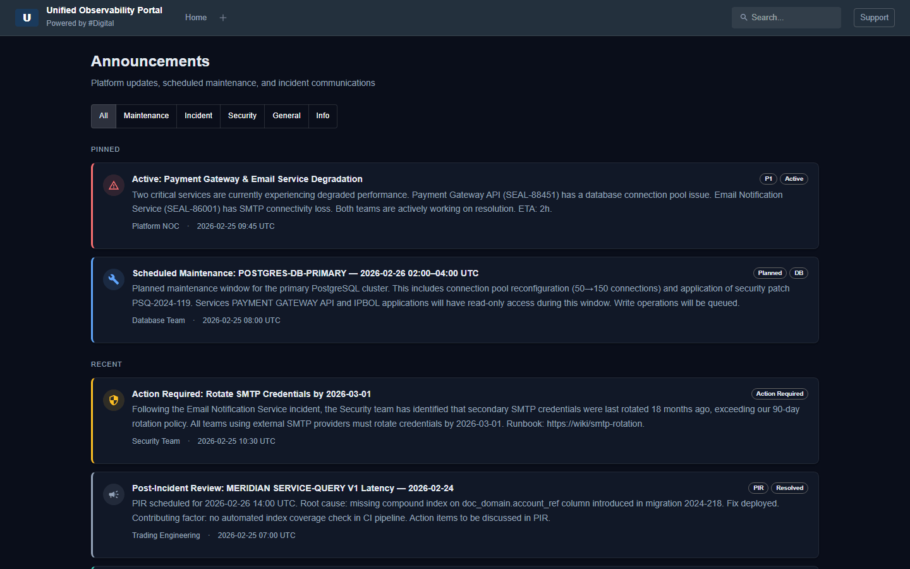

---

### Links
> Quick-access grid for monitoring, CI/CD, security, documentation, and team tools across 8 categories.

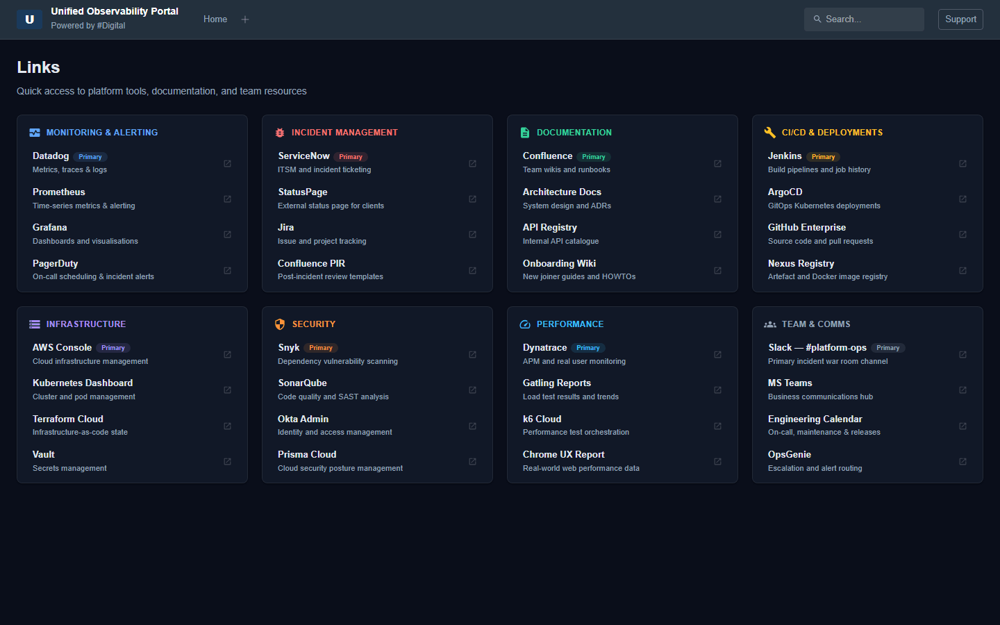

---

### Dark & Light Mode
> Full dark/light theme toggle with theme-aware cards, graphs, nav bar, and components.

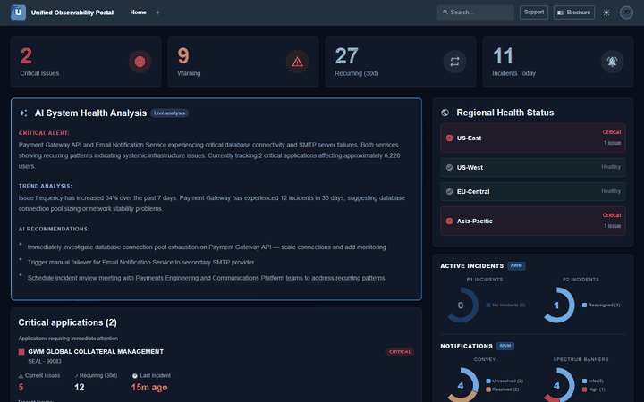

---

### Incident Zero
> Proactive pre-incident management — burn rate alerts, error budget dashboards, breach ETAs, and prevention timelines to stop P1s before they happen.

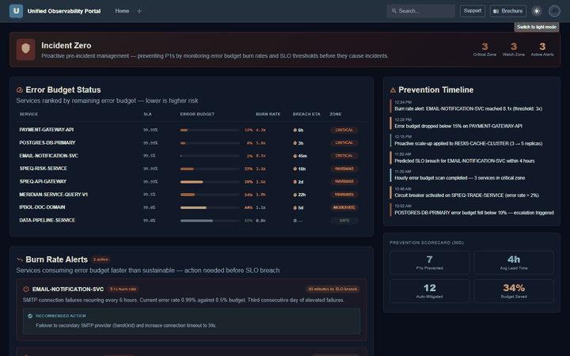

---

## Architecture

| Layer    | Stack                        | Port  |
|----------|------------------------------|-------|
| Frontend | React + Vite + MUI           | 5174  |
| Backend  | Python FastAPI + Uvicorn     | 8080  |

The frontend proxies all `/api/*` requests to the backend via Vite's dev server proxy.

---

## Platform Capabilities

| Tab | Feature | Description |
|-----|---------|-------------|
| **Home** | Dashboard | Critical apps, AI health analysis, regional status, active incidents, incident trends, frequent incidents, recent activities |
| **Favorites** | Pinned Views | Star any view for quick access — persists across sessions |
| **View Central** | 12 Views | Dependency graphs, analytics, AI tools, live monitoring by domain |
| **Product Catalog** | 6 Products | Per-product health, service counts, linked views (Advisor Connect, Spectrum, Connect OS, GWM, Client Case, IPBOL) |
| **Applications** | Registry | 20+ apps with status, SLA, team ownership, incident history, search & filter |
| **Blast Radius** | Dependency Graphs | 3 interactive scenarios with executive summary, root cause, business processes, dagre layout |
| **Customer Journeys** | Path Health | Trade Execution, Client Login, Document Delivery with step-by-step latency |
| **SLO Agent** | AI Agent | Breach prediction, error budget tracking, auto-remediation actions |
| **Announcements** | CRUD Management | Create, edit, close/reopen, delete, search, type filters, pinning, auto-refresh |
| **Links** | Quick Access | 8 categories — monitoring, CI/CD, security, documentation, team tools |

Additional features:
- **Incident Zero** — Proactive pre-incident management with burn rate alerts and error budgets
- **Dark / Light Mode** — Full theme toggle with theme-aware components
- **Draggable Tabs** — Browser-style tab reordering with drag-and-drop, persistent via localStorage

---

## Navigation

The top nav starts with only the **Home** tab visible. Click the **+** button to add any tab. Tabs can be **dragged and reordered** like browser tabs. Each added tab has an **×** to close it. Tab order and selection persist across browser sessions via localStorage.

---

## Start

Open two terminals from the project root.

**Backend**
```bash
cd backend
python -m uvicorn main:app --reload --port 8080
```

**Frontend**
```bash
cd frontend
npm run dev
```

Open: http://localhost:5174

---

## Stop

**Kill all (recommended)**
```bash
taskkill //F //IM python.exe
taskkill //F //IM node.exe
```

**Kill by specific port**
```bash
# Find PIDs
netstat -ano | grep -E "8080|5174"

# Kill specific PID
taskkill //F //PID <pid>
```

**Check what's running**
```bash
netstat -ano | grep "LISTENING" | grep -E "8080|5174"
tasklist | grep -E "node|python"
```

---

## Project Structure

```
obs-dashboard/
├── backend/
│   ├── main.py          # FastAPI app — all endpoints and mock data
│   └── requirements.txt
├── frontend/
│   ├── src/
│   │   ├── components/  # TopNav, ViewCard, CriticalApps, DependencyFlow,
│   │   │                #   IncidentTrends, BrochureModal, ActiveIncidentsPanel,
│   │   │                #   FrequentIncidents, RecentActivities, AIHealthPanel
│   │   ├── pages/       # Dashboard, GraphExplorer, Applications, Favorites,
│   │   │                #   ViewCentral, ProductCatalog, CustomerJourney,
│   │   │                #   SloAgent, IncidentZero, Announcements, Links
│   │   ├── ThemeContext.jsx  # Dark/light mode context + provider
│   │   └── App.jsx      # Router and nav
│   └── vite.config.js   # Dev server — proxy points to :8080
└── docs/
    ├── make_gifs.py     # Playwright script to regenerate all GIFs
    └── gifs/            # Demo GIFs
```

---

## API Endpoints

| Method | Path                               | Description                          |
|--------|------------------------------------|--------------------------------------|
| GET    | `/api/health-summary`              | Critical/warning/incident counts     |
| GET    | `/api/ai-analysis`                 | AI-generated health analysis         |
| GET    | `/api/regional-status`             | Per-region health status             |
| GET    | `/api/critical-apps`               | Apps in critical/warning state       |
| GET    | `/api/incident-trends`             | 90-day P1/P2 incident trend data     |
| GET    | `/api/frequent-incidents`          | Top recurring incidents (30d)        |
| GET    | `/api/active-incidents`            | P1/P2/Convey/Spectrum breakdowns     |
| GET    | `/api/recent-activities`           | Activity feed by category            |
| GET    | `/api/announcements`               | List announcements (?status, ?search)|
| POST   | `/api/announcements`               | Create announcement                  |
| PUT    | `/api/announcements/{id}`          | Update announcement                  |
| PATCH  | `/api/announcements/{id}/status`   | Toggle open/closed                   |
| DELETE | `/api/announcements/{id}`          | Delete announcement                  |
| GET    | `/api/graph/nodes`                 | All service nodes                    |
| GET    | `/api/graph/dependencies/{id}`     | Downstream dependencies for service  |
| GET    | `/api/graph/blast-radius/{id}`     | Upstream impact for service          |

Interactive API docs: http://localhost:8080/docs

---

## Regenerate GIFs

Requires the app running at http://localhost:5174 first, plus Playwright and Pillow:

```bash
pip install playwright pillow
playwright install chromium
python docs/make_gifs.py
```

GIFs are generated at 720p width with 128-color quantization for fast auto-play on GitHub.
